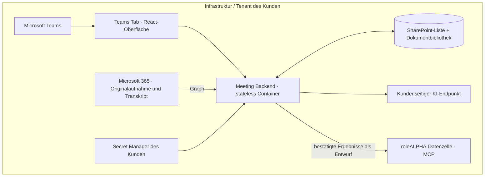

> Historischer Backend-Prototyp. Für die aktuelle serverlose App gilt [customer-deployment.md](customer-deployment.md). Dieses Dokument beschreibt keinen erforderlichen Bestandteil der neuen Auslieferung.

# Kundeninstallation mit SharePoint-Persistenz

Die Anwendung verwendet produktiv SharePoint als Speicher. Eine separate SQL-Datenbank entfällt. Die aktuelle Auslieferung benötigt weiterhin eine kundenseitige Node-/Container-Runtime für Anmeldung, Graph, KI und MCP. Ein serverloses SPFx-App-Katalog-Paket ist noch nicht enthalten; die Installation erfordert einmalig die Microsoft-365-Administration.

## Betriebsgrenze



Der Hersteller liefert ein Container-Image und Softwareupdates. Das ist kein Datenpfad. Es gibt keinen notwendigen zentralen roleALPHA-Dienst. Insbesondere keine zentral gespeicherten Tokens, Warteschlangen, Transkripte oder Meetingmetadaten.

Bei kundenseitig betriebenen Microsoft-/KI-Diensten sind deren Datenverarbeitungs- und Regionskonfigurationen maßgeblich. Die Software erzwingt nicht, dass ein beliebig eingetragener Endpunkt dem Kunden gehört: dies wird beim Kunden-Deployment kontrolliert. Alle URLs sind feste Serverkonfiguration, nicht durch Transkript oder Nutzer frei wählbar.

## Empfohlene Azure-Zuordnung

| Baustein | Ressource im Kunden-Tenant |
|---|---|
| App-Image | Azure Container Registry des Kunden |
| Oberfläche und API | Azure Container Apps oder App Service |
| Meetingdaten und Jobqueue | SharePoint-Site: Indexliste und Dokumentbibliothek |
| Anmeldung | Entra App Registration des Kunden |
| Secrets | Azure Key Vault mit kundenseitiger Runtime-Injektion |
| Transkript / Aufnahme | Microsoft 365 des Kunden |
| KI | Kundeneigener kompatibler Endpunkt; z. B. Azure-Modellbereitstellung oder eigenes Modell |
| Export | Kundenseitige roleALPHA-Datenzelle, Dienst `ra-meetings` |

Keine D1-, Hersteller-Supabase- oder roleALPHA-Zentraldatenbank wird benötigt. Für Kubernetes/On-Premises gilt dieselbe Aufteilung.

## SharePoint einrichten

Eine dedizierte Site im Kunden-Tenant verwenden. Der Runtime-App `Sites.Selected` als Application Permission mit Admin Consent zuweisen; zusätzlich die Site explizit für diese App mit Schreibrechten freigeben. Für das **Anlegen** von Listen/Bibliotheken muss eine berechtigte Provisionierungsidentität verwendet werden; entsprechende Rechte anschließend entfernen. Tenant-weite Rechte sind für den laufenden Speicherzugriff nicht erforderlich.

1. `SHAREPOINT_SITE_ID` und kundeneigene Entra-Anmeldedaten in der lokalen Installationsumgebung setzen.
2. `npm run sharepoint:provision` ausführen. Das Skript legt ausschließlich `rA Meetings Index` und `rA Meetings Data` in dieser Site an, verwendet vorhandene gleichnamige Ressourcen erneut und prüft deren Schema. Die Ausgabe enthält die IDs, keine Tokens.
3. Diese Einstellungen in die Kunden-Runtime übernehmen:

```text
STORAGE_BACKEND=sharepoint
SHAREPOINT_SITE_ID=<Graph site ID>
SHAREPOINT_LIST_ID=<Index list ID>
SHAREPOINT_DRIVE_ID=<Document library drive ID>
DEFAULT_LANGUAGE=de
```

`DEFAULT_LANGUAGE` ist `de`, `en`, `fr` oder `es` und bestimmt die Sprache der einmalig angelegten Startvorlagen sowie automatischer Auswertungen. Vorhandene Templates werden nicht überschrieben. Die persönliche Oberflächensprache wird unabhängig gewählt.

Die Indexliste benötigt `RecordKey` (Text, eindeutig und indexiert), `RecordKind` (Text, indexiert), `RecordId` (Text), `RecordVersion` (Zahl) und `PayloadId` (Text). Große JSON-Inhalte liegen als unveränderliche Dateien in der Bibliothek; damit hängen Transkripte nicht von Textfeldgrenzen einer Liste ab. Änderungen laden eine neue Datei hoch und aktualisieren den Index mit `If-Match`. Bei einem Versionskonflikt bleibt die vorherige Version gültig. Das ist keine verteilte Transaktion: nach Fehlern können nicht referenzierte Dateien zurückbleiben.

**Berechtigungen:** Index und Bibliothek enthalten auch Transkripte und Autorisierungsmetadaten. Endanwender dürfen darauf nicht direkt per SharePoint zugreifen; ausschließlich Runtime-App und berechtigte Kundenadministratoren erhalten direkten Zugriff. Die API prüft Meeting-Mitgliedschaft und Moderationsrechte. Eine Freigabe der gesamten Bibliothek an alle Teilnehmer würde diese fachlichen Zugriffsschranken umgehen.

**Aufbewahrung:** Frühere Snapshots und bei Konflikten entstandene Dateien werden absichtlich nicht automatisch gelöscht. Löschen eines Templates entfernt seinen Indexeintrag, nicht jede historische Datei. Kunden müssen Retention, Löschung und Wiederherstellung für **Liste und Bibliothek gemeinsam** festlegen. Ein automatischer Garbage Collector ist nicht implementiert. In einer großen Installation müssen SharePoint-Listenschwellen, Graph-Throttling und Pollinglast abgenommen werden; die aktuelle Implementierung liest Datensätze seitenweise, aber lädt eine Meetingliste noch vollständig.

### Vorhandene Prototypdaten übernehmen

Schreibzugriffe während der Migration stoppen und Quelle sichern. `MIGRATION_SOURCE` auf den bisherigen SQLite-Pfad oder die PostgreSQL-Verbindung setzen; `MIGRATION_SOURCE_TENANT` optional auf den bisherigen Mandanten (z. B. `local`). Dann `npm run sharepoint:migrate`. Das Skript kopiert Templates, Spannungen und Meetings mit ihren Versionen, liest jeden neuen Datensatz zur Prüfung zurück und bricht bei abweichenden Zieldaten ab. Die Quelle bleibt erhalten. Alte Queue-Einträge werden nicht übernommen; Transkriptabrufe danach manuell prüfen. Entra-Mitglieder/Ersteller aus lokaler Demo müssen vor Produktivnutzung kontrolliert zugeordnet werden. Der alte SQL-Adapter bleibt nur für Entwicklung und diese Migration im Repository.

## Entra-Registrierung

1. Single-Tenant-App registrieren, die API exponieren und ein Application-ID-URI `api://<kunden-hostname>/<client-id>` einrichten.
2. Delegierten Scope `access_as_user` definieren. Microsoft Teams Desktop/Mobile und Web als vorautorisierte Clients gemäß Microsoft-SSO-Dokumentation konfigurieren.
3. Access-Token-Version 2 konfigurieren. Das Backend validiert Signatur über Tenant-JWKS, `iss`, `aud`, `tid`, `oid`, Ablauf sowie den delegierten Scope. `ENTRA_AUDIENCE` ist bei v2-Tokens normalerweise die Client-ID.
4. App-Rolle `Meeting.Admin` mit erlaubtem Mitgliedstyp `User` anlegen und Administratoren/Gruppen zuweisen. Nur diese verwalten Templates. Die erstellende Person moderiert ihr Meeting; explizit angegebene Mitglieder lesen mit.
5. Für Graph Application Permissions `OnlineMeetingTranscript.Read.All` mit Admin Consent einrichten. Soweit der genutzte Graph-Endpunkt es verlangt, eine Application Access Policy für berechtigte Organizer konfigurieren. Der verwendete Code nutzt diesen Application-Permission-Pfad, nicht RSC.
6. `ENTRA_CLIENT_SECRET` aus dem Kunden-Secret-Manager bereitstellen. Der aktuelle SharePoint-Adapter benötigt diese kundenseitige App-Authentifizierung auch ohne automatischen Transkriptimport.

Teams-Client-IDs und Tenant-Policies anhand der aktuellen Microsoft-Dokumentation überprüfen. Keine Anmeldung oder Lizenz wird automatisch provisioniert.

## Graph-Verknüpfung

Unter „Transkript & Analyse“ Organizer-Objekt-ID und Graph-`onlineMeetingId` angeben. Nur der Organizer oder ein App-Administrator darf verknüpfen. Die Verknüpfung eines Datensatzes lässt sich später nicht auf ein anderes Teams-Meeting umbiegen.

Webhook-URLs:

```text
https://<kunden-hostname>/api/graph/notifications
https://<kunden-hostname>/api/graph/lifecycle
```

Der Validierungs-Handshake wird unterstützt; Benachrichtigungen werden gegen Subscription-ID und zufälliges `clientState` geprüft. Angegebene Resource-URLs werden nie direkt heruntergeladen. Der Worker lädt nur das fest gebundene Meeting über Microsoft Graph.

Subscriptions werden für 50 Minuten erstellt und vor Ablauf erneuert. Nach Ablauf wird eine neue Subscription angelegt. Verarbeitung läuft über persistierte Jobs in derselben SharePoint-Ablage. Graph-Import und optional aktivierte KI-Auswertung haben begrenzte Wiederholungen; keine stillen Endlosschleifen. Die automatische Erneuerung endet 24 Stunden nach Abschluss in dieser App. Schlägt die Verarbeitung endgültig fehl, erscheint ein Meetingereignis. „Transkript jetzt abrufen“ dient auch als manuelle Wiederherstellung.

Transkription muss im Teams-Meeting selbst aktiviert sein. Für zuverlässige Benachrichtigungen vor Beginn der Transkription verknüpfen. Unterstützung für Channel-/Privatkanal-/Ad-hoc-Meetings und Tenant-Zugriff hängt von Microsofts API und Tenant-Policies ab; zunächst geplante private Meetings abnehmen. Der Import lädt alle verfügbaren Transkriptteile in zeitlicher Reihenfolge.

## KI-Vertrag

`AI_COMPLETIONS_URL`, `AI_MODEL` und bei Bedarf `AI_API_KEY` setzen. Der Dienst muss JSON Chat-Completions mit `messages`, `model` und `response_format: {type: 'json_object'}` unterstützen und `choices[0].message.content` mit JSON liefern. Default-Authentifizierung: Bearer. Mit `AI_AUTH_HEADER=api-key` kann ein Azure-kompatibler Deployment-Endpunkt konfiguriert werden; die vollständige URL einschließlich API-Version wird vom Kunden gesetzt.

Die App sendet Meetingtitel, Kreisbezeichnung, Template-Schritte, Agenda, Notizen, Ereignisse und Transkript an diesen Endpunkt. Sie sendet keine Graph-/MCP-Zugangsdaten. Das Modell erhält keine ausführbaren MCP-Tools. Die Antwort wird fachlich validiert, bevor sie als Vorschlag gespeichert wird.

### KI während des Meetings

„Vorschlag & Einwände“ ist für die Meeting-Leitung an offenen Agendapunkten verfügbar. Proposal Forming nutzt Titel, Schrittbeschreibung, Bedarf/Kontext und optional bisherigen Wortlaut. Die Einwandintegration benötigt zusätzlich einen Vorschlag und Einwände. Es werden weder das gesamte Transkript noch andere Agendaeinträge übertragen. Die Sprachwahl der Oberfläche bestimmt die Antwortsprache.

`POST /api/meetings/:id/assist` erzeugt nur eine validierte Vorschau. Menschen prüfen Rückfragen und Integrationsmöglichkeiten, übernehmen bei Bedarf Text in das Eingabefeld und speichern den geprüften Vorschlagsentwurf über einen revisionsgesicherten Meeting-Befehl. Es gibt keine automatische Einwandbewertung, Zustimmung, Phasenfortschaltung oder MCP-Aktion. Ohne KI-Verbindung bleibt das manuelle Formulieren und Speichern nutzbar.

## MCP-Vertrag

Endpoint des Kunden-Fachservices `ra-meetings` konfigurieren (`/mcp`, Streamable HTTP). Der Bearer muss zum Zielmandanten passen und dort Entwürfe erstellen dürfen.

Verwendetes Tool:

```text
create_meeting({ tenant_uuid, name, custom_id, data })
```

Erwartete Antwort als strukturiertes Ergebnis oder JSON-Text:

```json
{"draft_created":true,"draftId":"…","entityUuid":"…","status":"draft"}
```

`data` enthält ein `ra-meeting/1`-Dokument mit bestätigten Ergebnissen und den zugehörigen Belegsegmenten, nicht pauschal die komplette Aufnahme oder das gesamte Transkript. Der stabile `custom_id` dient der Nachverfolgung. Der existierende MCP-Vertrag garantiert keine Idempotenz: bei Timeout ist deshalb kein automatischer Schreib-Retry erlaubt. Ein Benutzer dokumentiert stattdessen den Abgleich mit roleALPHA.

Der Export ist bewusst ein Meeting-Entwurf. Direkte Rollenänderungen dürfen nicht aus bloßem Erwähnen im Transkript entstehen.

## Teams-App-Paket

Zusätzlich zu den Runtime-Einstellungen folgende Build-Werte setzen:

```text
APP_ID=<Teams-App-UUID>
ENTRA_CLIENT_ID=<Entra-App-UUID>
PUBLIC_URL=https://meetings.customer.example
CUSTOMER_NAME=<Kundenname>
PRIVACY_URL=https://customer.example/privacy
TERMS_URL=https://customer.example/terms
```

Dann `npm run teams:package`. Das ZIP liegt in `teams/package/rolealpha-meetings.zip`, ausschließlich im Repository. In den kundeneigenen Teams-App-Katalog hochladen, die App zum Meeting hinzufügen, ein Meeting in der Konfigurationsseite auswählen und in Teams speichern. Die Live-Stage kann über die Teams-Oberfläche genutzt werden; eine eigene Share-to-Stage-Schaltfläche ist nicht enthalten.

## Container

```sh
docker compose --env-file .env -f deploy/customer-compose.yaml up --build -d
```

Die Beispielkonfiguration bindet lokal an Port 4310; davor einen kundenseitigen HTTPS-Reverse-Proxy betreiben. App in Container Apps alternativ direkt auf Port 4310 mit HTTPS-Ingress konfigurieren. Secrets in produktiven Umgebungen nicht in Compose-Dateien schreiben, sondern aus dem kundenseitigen Secret-Manager injizieren. Keine Kundendaten oder `.env` in Images einbauen.

## Abnahme vor Produktivnutzung

- Anmeldung als Admin, Moderator und lesender Teilnehmer im echten Teams-Client.
- SharePoint-Berechtigungen, konkurrierende Änderungen sowie gemeinsame Wiederherstellung von Index und Bibliothek.
- Tatsächliches Meeting transkribieren und Graph-Import beobachten.
- KI-Antwort mit echten freigegebenen Testdaten kontrollieren.
- MCP-Entwurf in der **Test-Datenzelle des Kunden** erzeugen und auffinden.
- Kundenseitige Netzwerkregeln: keine unbeabsichtigten ausgehenden Datenpfade; Logging und Modellregion kontrollieren.

Automatisierte Repositorytests ersetzen diese Tenant-Abnahme nicht.

## Optionaler Kalenderzugriff

Die aktuelle Backend-Variante benötigt für die Kalendersuche eine kundenseitig freigegebene Graph Application Permission `Calendars.Read` und Zugriff auf die jeweiligen Mailboxen. Nicht als bereits vorhandene Teams-Berechtigung voraussetzen. Ein Mitglied kann nur seinen eigenen Kalender auswählen; Administratoren können eine andere berechtigte Mailbox angeben. `/calendarView` expandiert Einzeltermine einer Serie. Der Abgleich ist lesend und wird ausdrücklich gestartet. Die spätere SPFx-Variante soll delegierten Benutzerzugriff verwenden.

## Optionale Hintergrundanalyse

`AUTO_ANALYZE_TRANSCRIPTS=false` ist der Standard. Importierte Transkripte werden erst nach Nutzeraktion ausgewertet. Mit `true` darf der Worker Vorschläge erzeugen; Bestätigung und Export bleiben menschliche Aktionen. Es gibt keine Power-Automate-Abhängigkeit.
